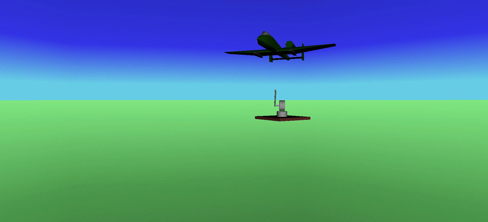

## Course Project of ECE570, Winter 2020 @ IIITD
### Group 2: Radar Control

	Run the "parameters.m" file to load the model parameters into workspace.
	Then Run Radar_Nonlinear_model.slx to simulate the controller. 
	VR block is added to visualise the animiation.

### Documents:
- [Report First Half](../main/Part_1/CNT_project_report.pdf)
- [Report Second Half](../main/Part_2/Report.pdf)